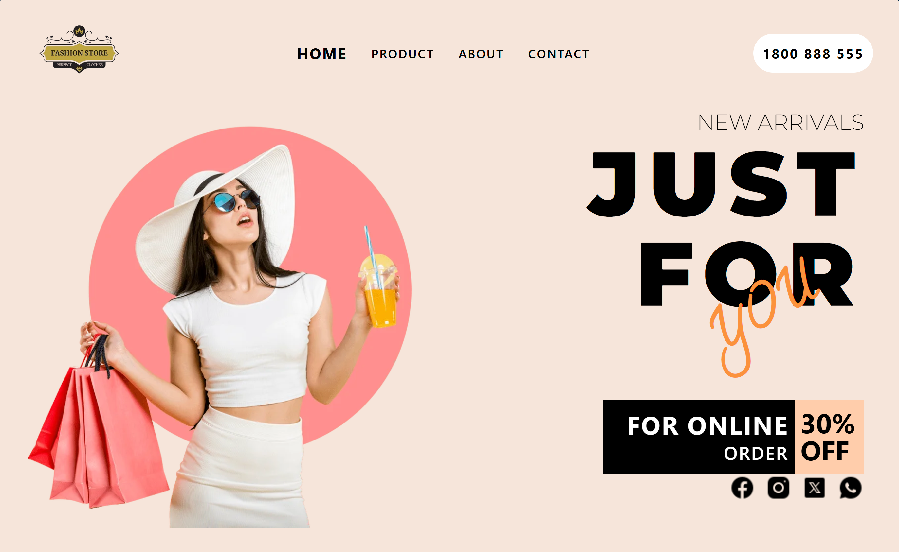

# FashionWebsite

Welcome to FashionWebsite, your destination for the latest fashion trends and stylish looks.

## Features
- Responsive design for optimal viewing on all devices
- Browse and search for products
- User accounts for personalized experiences
- Shopping cart and checkout process
- Contact form for inquiries

## Technologies
- **HTML**: The backbone of our web pages, providing structure and content.
- **CSS**: Used for styling and layout, ensuring the website looks attractive and user-friendly.
- **Tailwind CSS**: A utility-first CSS framework that provides highly customizable design elements to speed up development and maintain consistency.

## Installation
1. Clone the repository:
   ```bash
   git clone https://github.com/Ashmit72061/SkillOP-Work.git
   cd SkillOP-Work
---
